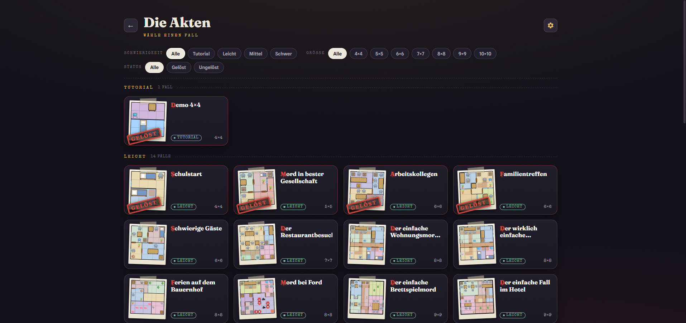
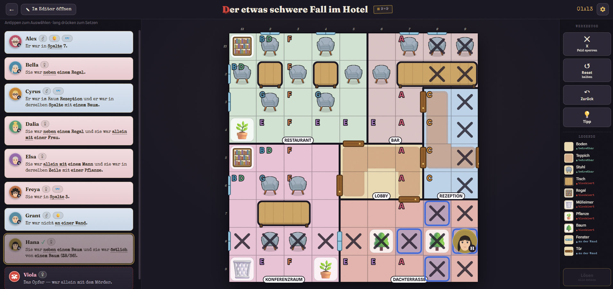
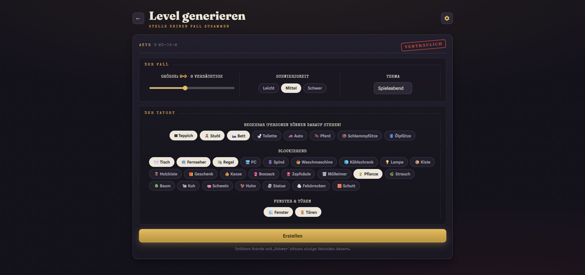
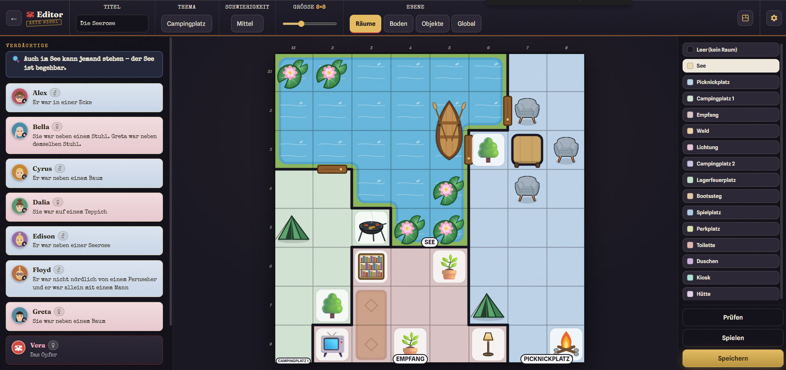

# Murdoku — Manhunt meets Sudoku

> *There was a murder last night. A handful of suspects, one victim, a floor plan full of clues — and only one arrangement that truly adds up. Grab your magnifying glass.*

**Murdoku** is a logic mystery for the web: the rigor of Sudoku married to the suspense of a whodunit. Every suspect leaves a clue — *"…was sitting on a chair", "…was in the same room as Bryson", "…was **not** beside a wall"*. You reason, cross out and place, until every person stands on exactly one tile. Whoever ends up **alone with the victim** in a room is the murderer.

<p align="center">
  
  
  
</p>
<p align="center">
  
  
</p>

<p align="center"><sub>Main menu · "The Files" (case selection) · An investigation in full swing · The case generator · The editor</sub></p>

---

## Why you'll get hooked

- **Pure deduction, zero luck.** Every case has exactly **one** solution, provable by logic alone — no guessing, ever.
- **143 case files out of the box.** Hand-built mysteries from a cosy **4×4** to a sprawling **12×12**, across three difficulties and a tutorial.
- **An endless supply of mysteries.** A built-in generator rolls fresh, guaranteed-unique cases across **14 themed settings** in three difficulties — you'll never run out.
- **Build your own.** A full editor lets you paint a crime scene, write the clues and verify it's solvable — then play it or save it.
- **Learn by doing.** An interactive, guided tutorial cracks a real mini-case *with* you, one step at a time.
- **A crime scene with character.** Hand-drawn suspects and **70+ themed props**, dressed in a moody "case-file" look down to the film grain.
- **Anywhere, in your language.** Plays beautifully on desktop and phone, in English, German, Spanish, Portuguese or French, with your progress saved automatically. On touch, tap a suspect's face and their dossier note unfolds — every term explained, every named person with their traits.

---

## A tribute to the inventor

The brilliant core idea — fusing Sudoku logic with a murder case — comes from **Manuel Garand**. This project is a loving, freely-interpreted homage to his concept and is not affiliated with him.

> **If you enjoy the principle, please buy Manuel Garand's book and support the inventor!** Without his idea, this crime scene wouldn't exist.

---

## How the investigation works

1. **Pick a suspect** from the file on the left. Their clue reveals where they could have been — the possible tiles light up.
2. **Place them** with a long press on a tile. A short tap leaves a pencil note instead.
3. As in Sudoku: **one person per row and per column.** When you place someone, Murdoku crosses out their whole row and column automatically — no tile can be used twice.
4. **Cross out** anything you can rule out yourself (even across furniture), until only one solution remains.
5. **Submit.** If everyone stands correctly, the mystery unravels: who was alone with the victim?

Stuck? The **hint giver** explains the next logical step in plain words — it never hands you the answer, just a nudge in the right direction.

---

## The clues

A whole vocabulary of evidence — **40 clue forms plus 5 case-wide clue types** — every piece rendered as a clean, grammatical sentence:

- **on** or **beside** an object, **beside a window**, **in a corner**, **against a wall**
- **in a row / column**, **alone in the room**, *"the only person on a chair"*
- **in the same room as** another suspect, and **compass directions** — *"north of Dana"*
- **room traits** — *"nobody in the room had a beard"*, *"a woman was in the room"*
- **room adjacency** — *"…in a room adjoining the kitchen"*, *"a neighbouring room stood empty"*
- **case-wide clues** — *"no room was empty"*, *"exactly 2 people were on a chair"*

…all combinable with **AND / OR** and individually negatable with **NOT**.

Suspects come with **traits that matter** — gender, beard, glasses, baldness and hair color. They aren't decoration; the logic leans on them, and each one has a hand-drawn avatar to match.

---

## The crime scene

Every case is dressed by hand to feel *built*, not random:

- **40+ objects** — armchairs, bookshelves, pianos, fridges, cars, beds, boats, tents, campfires, farm animals, statues and more — chosen to fit each setting. Boats and water lilies drift on the lake, cows fill the barn, fridges line the supermarket aisle, cars wait in the garage.
- **Pieces that merge** — beds, cars and rowing boats span two tiles and join into one seamless object; carpets and open water tile together into continuous surfaces.
- **Windows, doors, walls and soft pastel rooms**, with room names that follow the chosen theme.

---

## Endless cases — the generator

Out of files to crack? Roll a new one. The generator builds **uniquely-solvable** mysteries on demand:

- **14 themed settings** — apartment, mansion, grand hotel, police precinct, auto shop, school, hospital, farm, supermarket, campsite, castle, lido, zoo and ski resort — each with fitting rooms and props.
- **Three difficulties**, on boards from a tight **4×4** up to a sprawling **12×12**.
- Runs in a **pool of Web Workers** — several investigators hunt candidates in parallel and the best case wins — so the interface never stutters. Keep a case you like, export it as JSON, or simply play and move on.

---

## Build your own crime scene (the editor)

Got your own Murdoku puzzles on paper? Recreate them 1:1:

- Paint **rooms, floor, objects and windows** straight onto the board (4×4 up to 11×11).
- Create **suspects** (name, traits) and assemble their clues in the flat **clue builder** — including case-wide global clues.
- **"Check"** tells you whether the case is solvable **and unique** — and who the murderer would be.
- **"Play"** tests it instantly; **"Save"** files it (with name & difficulty) into your archive or exports it as JSON.

Room names follow the chosen theme — and can be swapped anytime.

---

## The settings desk

A gear in the corner of every screen opens the **settings case file**:

- **Language** — switch between English, German, Spanish, Portuguese and French at any time.
- **Investigation aid** — pick your rank: **Assistant** highlights every tile the statements still allow, **Inspector** marks only the clues' references (the objects, rooms and traces named), **Master Detective** shows nothing at all — you combine entirely on your own.
- **Stopwatch** — show or hide the elapsed-time counter in the game header.
- **Files by gender** — tint the suspect cards (and the victim's name) softly in rose and blue, or turn it off.

Everything is stored locally and applies across the game, picker, generator and editor instantly.

---

## A case file with atmosphere

Murdoku is dressed as a **noir case file**: warm near-black "interrogation room" ink, brass and crimson accents, and a faint **film grain** over the whole app. The display face is **Fraunces**, headings and testimony are typed in **Special Elite**, the body is **Spline Sans**. Cases arrive as **polaroid evidence cards** taped into place, solved files get a slanted crimson **SOLVED** stamp, the title bleeds its letters, and the generator is laid out as a stamped, **confidential** dossier. Form, not just function.

---

## Under the hood

Murdoku is built **engine-first**: the entire game logic is a pure, framework-free TypeScript engine (no React, no DOM) — testable, portable, and the single source of truth.

| Area        | Tech |
|-------------|------|
| **Engine**  | Pure TypeScript (strict): model, composable `Clue` classes, a backtracking **solver** (uniqueness oracle + answer key) and a **DeductionEngine** for explainable hints |
| **Frontend**| React 19 + Vite, board rendered on **Canvas 2D** |
| **Generator** | Builds guaranteed-unique cases across 14 themes, in a **Web-Worker pool** |
| **i18n**    | i18next / react-i18next — all text from locale files (EN, DE, ES, PT & FR) |
| **Quality** | Vitest, ESLint and strict `tsc` throughout |

---

## Getting started at the scene

```bash
npm install      # gather your gear
npm run dev      # start the investigation (dev server)
npm run build    # secure the evidence (production build)
npm run preview  # view the build locally
```

Quality assurance:

```bash
npm test         # engine tests (Vitest)
npm run lint     # ESLint
npm run typecheck
```

And a few bloodhounds for the engine — small CLIs that solve, generate and analyze cases:

```bash
npm run solve      # solve a case
npm run generate   # roll a new case
npm run show       # print a level in the terminal
npm run check      # verify levels are uniquely solvable
npm run hardest    # hunt down the trickiest cases
```

---

## Project structure

```
src/
  engine/        Pure-TS game logic: model · clues · solver · io · generator
  game/          Engine <-> UI bridge: board rendering, furniture art, sessions, settings, storage
  components/    React building blocks (board, file, toolbar, settings, editor …)
  screens/       Start · Case select · Game · Generator · Tutorial · Editor
  i18n/          English, German, Spanish, Portuguese & French + the clue renderer
levels/          Case files (JSON)
screenshots/     The images above
```

---

## Credits

Built by **Dirk Aporius** ([@TheApo](https://github.com/TheApo)) — from the pure logic engine down to the last hand-drawn armchair.

Original concept: **Manuel Garand**. Enjoying Murdoku? Then **buy his book** — and happy sleuthing.
